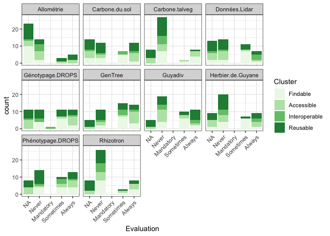

Analyse des grilles d’évaluation RDA SHARC
================
Antoine Blanchard
23/08/2021

-   [Import et nettoyage des données](#import-et-nettoyage-des-données)
-   [Classons les réponses possibles à chaque
    critère](#classons-les-réponses-possibles-à-chaque-critère)
-   [Passons de données wide à des données
    narrow](#passons-de-données-wide-à-des-données-narrow)
-   [Représentons graphiquement les réponses à chaque
    critère](#représentons-graphiquement-les-réponses-à-chaque-critère)

This is an [R Markdown](http://rmarkdown.rstudio.com) Notebook. When you
execute code within the notebook, the results appear beneath the code.

Try executing this chunk by clicking the *Run* button within the chunk
or by placing your cursor inside it and pressing *Cmd+Shift+Enter*.

## Import et nettoyage des données

``` r
data <- read.csv2("clean_data.csv", header = TRUE, sep = ",", row.names = "Code") %>%
  mutate(Cluster=factor(Cluster, levels = c("Findable", "Accessible", "Interoperable", "Reusable")))

data_wide <- data %>%
  filter (Cluster != "NA")
```

## Classons les réponses possibles à chaque critère

``` r
cols <- c("GenTree", "Phénotypage.DROPS", "Carbone.talveg", "Données.Lidar", "Herbier.de.Guyane", "Rhizotron", "Guyadiv", "Allométrie", "Carbone.du.sol", "Génotypage.DROPS")

data_wide[,cols] <- lapply(data_wide[,cols], factor, levels = c("Never", "Mandatory", "Sometimes", "Always"), exclude = "", ordered = T)

data_wide[,cols] <- lapply(data_wide[,cols], fct_explicit_na, na_level = "NA")

data_wide[,cols] <- lapply(data_wide[,cols], factor, levels = c("NA", "Never", "Mandatory", "Sometimes", "Always"), exclude = "", ordered = T)
```

## Passons de données wide à des données narrow

``` r
data_narrow <- data_wide %>%
  pivot_longer (cols = cols, names_to = "Dataset", values_to = "Evaluation") %>%
  mutate(Dataset=factor(Dataset))
```

    ## Note: Using an external vector in selections is ambiguous.
    ## ℹ Use `all_of(cols)` instead of `cols` to silence this message.
    ## ℹ See <https://tidyselect.r-lib.org/reference/faq-external-vector.html>.
    ## This message is displayed once per session.

## Représentons graphiquement les réponses à chaque critère

``` r
data_narrow %>%
  ggplot(aes(x = Evaluation, fill = Cluster)) + 
  geom_bar(position = position_stack(reverse = TRUE)) +
  facet_wrap(~ Dataset, ncol = 4) +
    scale_fill_manual(values = brewer.pal(4, "Greens")) +
  theme_bw() +
theme(axis.text.x = element_text(angle = 45, vjust = 1, hjust=1))
```

<!-- -->

``` r
data_narrow %>%
  filter(Dataset == "Allométrie") %>%
  ggplot(aes(x = Evaluation, fill = Cluster)) + 
  geom_bar(position = position_stack(reverse = TRUE)) +
  facet_wrap(~ Dataset, ncol = 4) +
  scale_fill_manual(values = brewer.pal(4, "Greens")) +
  theme_bw() +
  theme(axis.text.x = element_text(angle = 45, vjust = 1, hjust=1)) +
  theme(legend.position = "none")
```

<!-- -->

``` r
data_narrow %>%
  filter(Dataset == "Carbone.du.sol") %>%
  ggplot(aes(x = Evaluation, fill = Cluster)) + 
  geom_bar(position = position_stack(reverse = TRUE)) +
  facet_wrap(~ Dataset, ncol = 4) +
  scale_fill_manual(values = brewer.pal(4, "Greens")) +
  theme_bw() +
  theme(axis.text.x = element_text(angle = 45, vjust = 1, hjust=1)) +
  theme(legend.position = "none")
```

<!-- -->

``` r
data_narrow %>%
  filter(Dataset == "Carbone.talveg") %>%
  ggplot(aes(x = Evaluation, fill = Cluster)) + 
  geom_bar(position = position_stack(reverse = TRUE)) +
  facet_wrap(~ Dataset, ncol = 4) +
  scale_fill_manual(values = brewer.pal(4, "Greens")) +
  theme_bw() +
  theme(axis.text.x = element_text(angle = 45, vjust = 1, hjust=1)) +
  theme(legend.position = "none")
```

<!-- -->

``` r
data_narrow %>%
  filter(Dataset == "GenTree") %>%
  ggplot(aes(x = Evaluation, fill = Cluster)) + 
  geom_bar(position = position_stack(reverse = TRUE)) +
  facet_wrap(~ Dataset, ncol = 4) +
  scale_fill_manual(values = brewer.pal(4, "Greens")) +
  theme_bw() +
  theme(axis.text.x = element_text(angle = 45, vjust = 1, hjust=1)) +
  theme(legend.position = "none")
```

<!-- -->

``` r
data_narrow %>%
  filter(Dataset == "Phénotypage.DROPS") %>%
  ggplot(aes(x = Evaluation, fill = Cluster)) + 
  geom_bar(position = position_stack(reverse = TRUE)) +
  facet_wrap(~ Dataset, ncol = 4) +
  scale_fill_manual(values = brewer.pal(4, "Greens")) +
  theme_bw() +
  theme(axis.text.x = element_text(angle = 45, vjust = 1, hjust=1)) +
  theme(legend.position = "none")
```

<!-- -->

``` r
data_narrow %>%
  filter(Dataset == "Données.Lidar") %>%
  ggplot(aes(x = Evaluation, fill = Cluster)) + 
  geom_bar(position = position_stack(reverse = TRUE)) +
  facet_wrap(~ Dataset, ncol = 4) +
  scale_fill_manual(values = brewer.pal(4, "Greens")) +
  theme_bw() +
  theme(axis.text.x = element_text(angle = 45, vjust = 1, hjust=1)) +
  theme(legend.position = "none")
```

<!-- -->

``` r
data_narrow %>%
  filter(Dataset == "Herbier.de.Guyane") %>%
  ggplot(aes(x = Evaluation, fill = Cluster)) + 
  geom_bar(position = position_stack(reverse = TRUE)) +
  facet_wrap(~ Dataset, ncol = 4) +
  scale_fill_manual(values = brewer.pal(4, "Greens")) +
  theme_bw() +
  theme(axis.text.x = element_text(angle = 45, vjust = 1, hjust=1)) +
  theme(legend.position = "none")
```

<!-- -->

``` r
data_narrow %>%
  filter(Dataset == "Rhizotron") %>%
  ggplot(aes(x = Evaluation, fill = Cluster)) + 
  geom_bar(position = position_stack(reverse = TRUE)) +
  facet_wrap(~ Dataset, ncol = 4) +
  scale_fill_manual(values = brewer.pal(4, "Greens")) +
  theme_bw() +
  theme(axis.text.x = element_text(angle = 45, vjust = 1, hjust=1)) +
  theme(legend.position = "none")
```

<!-- -->

``` r
data_narrow %>%
  filter(Dataset == "Guyadiv") %>%
  ggplot(aes(x = Evaluation, fill = Cluster)) + 
  geom_bar(position = position_stack(reverse = TRUE)) +
  facet_wrap(~ Dataset, ncol = 4) +
  scale_fill_manual(values = brewer.pal(4, "Greens")) +
  theme_bw() +
  theme(axis.text.x = element_text(angle = 45, vjust = 1, hjust=1)) +
  theme(legend.position = "none")
```

<!-- -->

``` r
data_narrow %>%
  filter(Dataset == "Génotypage.DROPS") %>%
  ggplot(aes(x = Evaluation, fill = Cluster)) + 
  geom_bar(position = position_stack(reverse = TRUE)) +
  facet_wrap(~ Dataset, ncol = 4) +
  scale_fill_manual(values = brewer.pal(4, "Greens")) +
  theme_bw() +
  theme(axis.text.x = element_text(angle = 45, vjust = 1, hjust=1)) +
  theme(legend.position = "none")
```

<!-- -->
